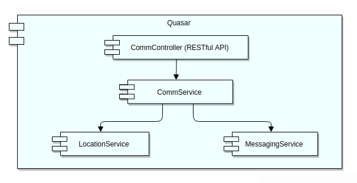
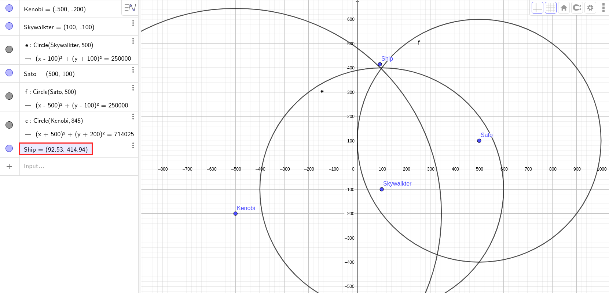
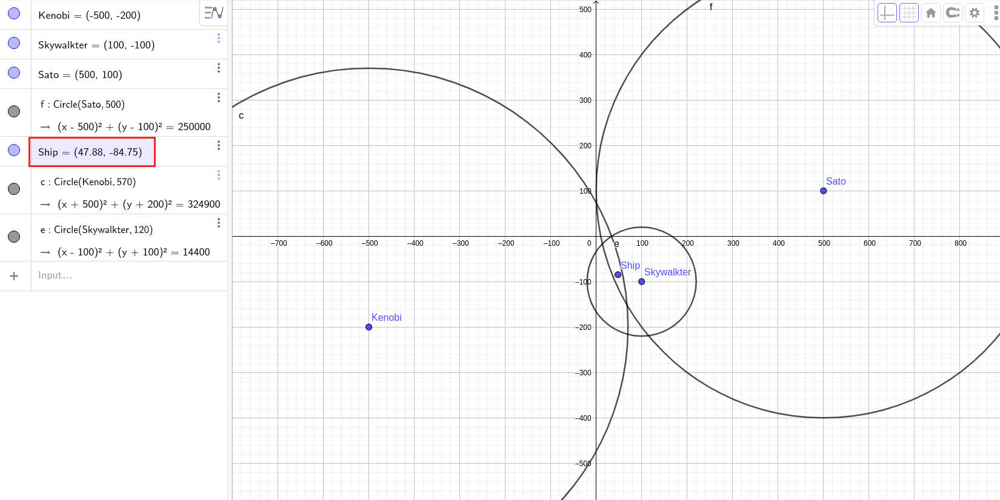

# Operacion Fuego de Quasar

## Tecnologías
  - Java 8
  - Spring Boot (https://spring.io/projects/spring-boot)
  - ModelMapper (http://modelmapper.org/)
  - Gradle (https://gradle.org/)
  
## Correr el servicio
 ./gradlew bootRun
 
## Correr test unitarios / tests de integración
 ./gradlew test
 
## Endpoints
- topsecret
###### Descripción:
Calcula la posición de la nave y mensaje basándose en la información recibida desde los 3 satélites (KENOBI, SKYWALKER, SATO).
```
- METHOD
POST
- URL
https://quasar-wat.herokuapp.com/api/v1/comm/topsecret
- HEADERS
Content-Typeapplication/json
- BODY
{
    "satellites": [
        {
            "name": "kenobi",
            "distance": 845,
            "message": ["este", "", "", "mensaje", ""]
        },
        {
            "name": "skywalker",
            "distance": 500,
            "message": ["", "es", "", "", "secreto"]
        },
        {
            "name": "sato",
            "distance": 500,
            "message": ["este", "", "un", "", ""]
        }
    ]
}
- SUCCESS RESPONSE CODE
200
- RESPONSE
{
    "x": 92.53125,
    "y": 414.9375,
    "message": [
        "este",
        "es",
        "un",
        "mensaje",
        "secreto"
    ]
}
```

- topsecret_split (POST)
###### Descripción:
Establece la distancia de la nave a un satélite dado y cual fue el mensaje recibido.
```
- METHOD
POST
- URL
https://quasar-wat.herokuapp.com/api/v1/comm/topsecret_split/sato
- HEADERS
Content-Typeapplication/json
- BODY
{
    "distance": 100.0,
    "message": ["este", "", "", "mensaje", ""]
}
- SUCCESS RESPONSE CODE
200
- RESPONSE
```

- topsecret_split (GET)
###### Descripción:
Calcula la posición de la nave y mensaje basándose en la información previamente recibida en diferentes llamadas al endpoint topsecret_split (POST).
Se necesitan 3 llamadas validas previas (una por cada satélite) al endpoint topsecret_split (POST) para que este endpoint pueda responder, una vez que ha respondido los datos guardados en el servicio se eliminan.

```
- METHOD
GET
- URL
https://quasar-wat.herokuapp.com/api/v1/comm/topsecret_split
- HEADERS
Content-Typeapplication/json
- BODY
- SUCCESS RESPONSE CODE
200
- RESPONSE
{
    "x": 92.53125,
    "y": 414.9375,
    "message": [
        "este",
        "es",
        "un",
        "mensaje",
        "secreto"
    ]
}
```

- Health check
###### Descripción:
Usado para determinar si el servicio esta activo.
```
- METHOD
GET
- URL
https://quasar-wat.herokuapp.com/actuator/health
- HEADERS
- BODY
- SUCCESS RESPONSE CODE
200
- RESPONSE
{
  "status": "UP"
}
```

## Notas
- Si la posición o mensaje no pueden ser calculados debido a falta de información o a un error el servicio responde 404 (NOT FOUND),
en cambio si el servicio detecta datos de entrada inválidos (distancia negativa, satélite no existente, mensaje vacio, etc) el mismo responde 400 (BAD REQUEST).

## Diagrama de componentes


## Comprobación de resultados de trilateración


